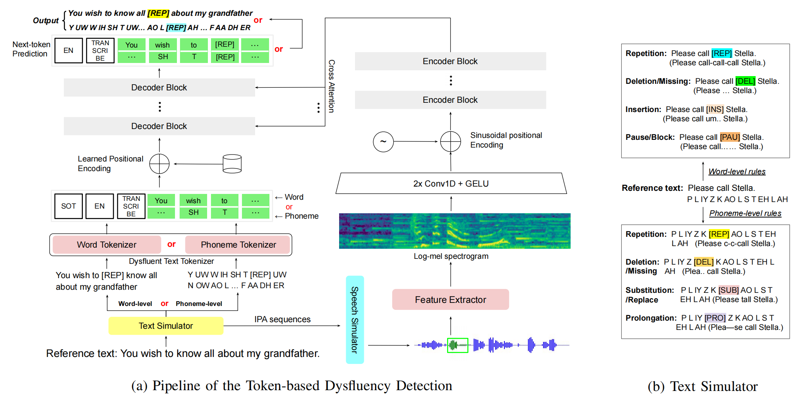

# Time and Tokens: Benchmarking End-to-End Speech Dysfluency Detection





## Datasets
We open sourced our simulated datasets **VCTK-Token**.

**Download link will be attached soon.**

## Environment configuration
Please refer [environment.yml](environment.yml)

If you have Miniconda/Anaconda installed, you can directly use the command: `conda env create -f environment.yml`


## Inference
We opensourced our inference code and checkpoints, here are the steps to perform inference:

0. Clone this repository.
  
1. Download [checkpoints](https://drive.google.com/drive/folders/14N8-ax3DOxJc64PvrHrv4jHNwCI5u3_o?usp=sharing), create a folder named `pretrained`, and put all downloaded models into it.
   
2. We also provide testing datasets for quick inference, download it [here](https://drive.google.com/drive/folders/1kYQsw8snX6D53lX1_gQio2SZs0xpSHx_?usp=sharing). Put the folder `testingset` at the same level as `inference.ipynb`.
   
3. Run `inference.ipynb` to perform inference step by step.


## Citation

If you find our paper helpful, please cite it by:
```sh
@misc{zhou2024timetokensbenchmarkingendtoend,
      title={Time and Tokens: Benchmarking End-to-End Speech Dysfluency Detection}, 
      author={Xuanru Zhou and Jiachen Lian and Cheol Jun Cho and Jingwen Liu and Zongli Ye and Jinming Zhang and Brittany Morin and David Baquirin and Jet Vonk and Zoe Ezzes and Zachary Miller and Maria Luisa Gorno Tempini and Gopala Anumanchipalli},
      year={2024},
      eprint={2409.13582},
      archivePrefix={arXiv},
      primaryClass={eess.AS},
      url={https://arxiv.org/abs/2409.13582}, 
}
```
